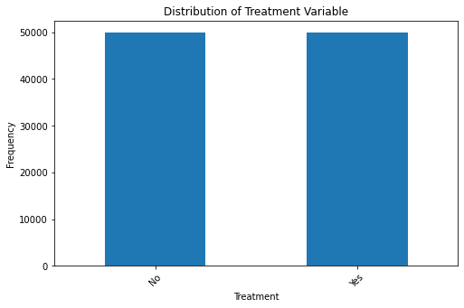
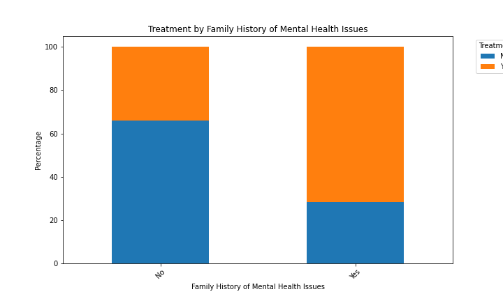
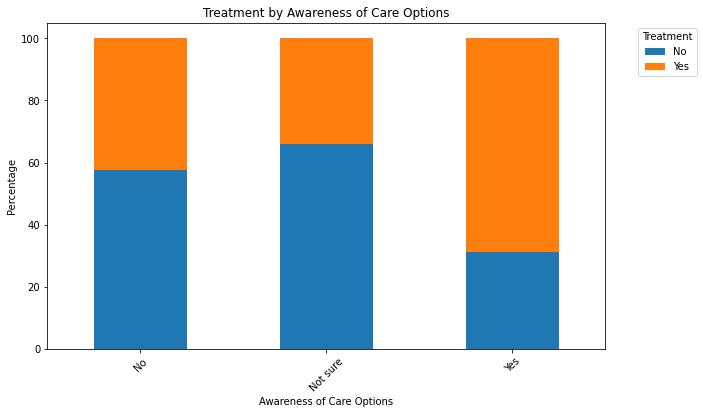
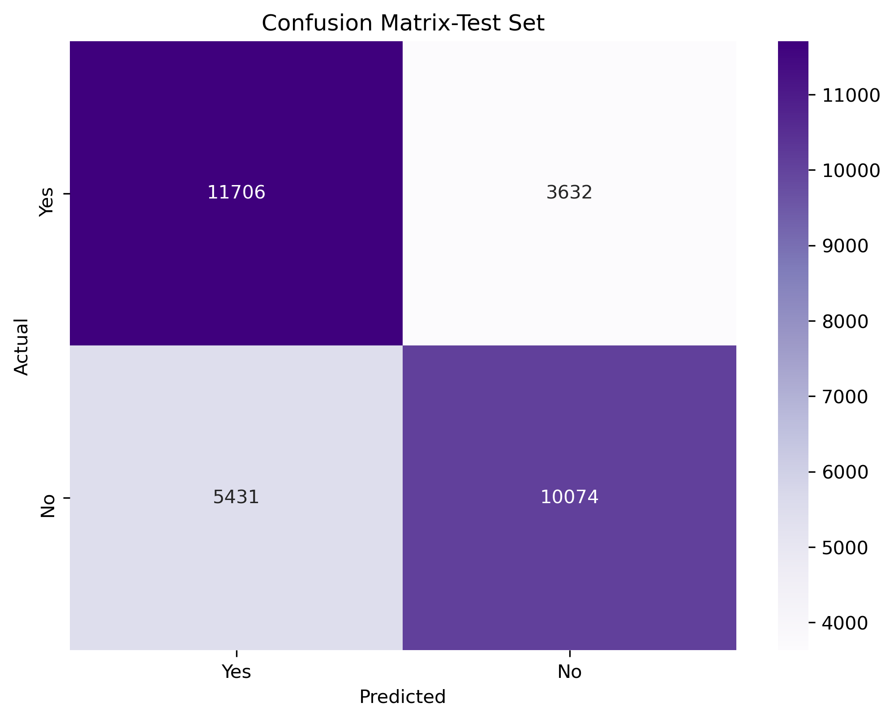
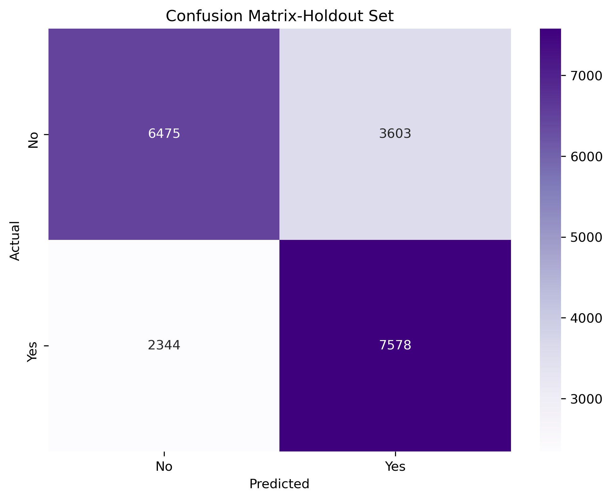

# Will-They-Seek-Treatment
   A model that can predict whether someone would seek treatment for a mental illness on their own.

## Business Understanding:
   Mental Illness is a real issue in the United States but too many people do not want to talk about it or admit it. Sometimes they feel it is a weakness or that nobody would understand. Sometimes they just do not know where to start. Some even feel like it is so over dramatized now a days, they do not want to be just part of the hype.
   
   My goal is to build a predictive model to determine if someone would seek treatment for a mental illness or not. This project means a lot to me because I have close friends and family members who deal with mental illness. Some did seek treatment did seek treatment on their own, while others needed a little encouragement and to know they were not alone.
   
   So, I geared this project towards everyday friends and family members who feel someone close to them may be struggling with a mental illness. My motivation for this project is to hopefully deploy a model to help people recognize those who need treatment but will not seek it for themselves. 
   
   
## Dataset:
   I decided to work with the Mental Health Dataset from Kaggle. 

   https://www.kaggle.com/datasets/bhavikjikadara/mental-health-dataset

   The features are all clear and defined and the overall data looks clean. The data is in a CSV format. It consists of just under 300,000 rows and 17 columns. The data types are all objects and are mostly strings or booleans.
   
   #### Column Explanations:
1. __Timestamp__ - Time survey was submitted.
2. __Gender__ - Respondent's Gender.
3. __Country__ - Respondent's Country.
4. __Occupation__ - Respondent's Occupation.
5. __Self Employed__ - Whether the Respondent is self-employed.
6. __Family History__ - Whether there is a family history of mental health issues.
7. __Treatment__ - Whether the Respondent sought treatment for mental health issues.
8. __Days Indoors__ - Number of days Respondent spends inside.
9. __Growing Stress__ - Whether the Respondent is experiencing growing stress.
10. __Changes Habits__ - Whether the Respondent has changed their eating or sleeping habits.
11. __Mental Health History__ - Whether the Respondent has a history of mental health issues.
12. __Mood Swings__ - The frequency of mood swings experienced by the Respondent.
13. __Coping Struggles__ - Whether the Respondent struggles to cope with daily problems/stress.
14. __Work Interest__ - Whether the Respondent has lost interest in work.
15. __Social Interest__ - Whether the Respondent feels socially weak.
16. __Mental Health Interview__ - Willingness to discuss mental health in an interview.
17. __Care Options__ - Respondent's awareness of mental health care options available?

## EDAs, Down Sampling and Feature Selection:
   I dropped the Timestamps column, kept only the United States cases, and I simply dropped the nulls from Self Employed. This left me roughly 168,000 rows across 16 columns.
    From there I decided to downsize the dataset by down sampling the target variable Treatment to include 50,000 Yes's and 50,000 No's.
    
   
    
   I compared a few other columns to Treatment using bar charts such as Family History of Mental Health and Awareness of Care Options. 
   

  
  

   
   Since my Data Frame is entirely categorical values, I decided to create a for loop to preform a __Chi-Squared test__ on each column versus Treatment to determine which features correlate the most with my target variable.

I Formulated a single Hypotheses for each pair of variables.

__H0 (Null Hypothesis):__ There is no association between the two categorical variables (example: between treatment and Occupation).

__H1 (Alternative Hypothesis):__ There is an association between the two categorical variables.

   Here are a few of the results. The full results can be seen in the EDAs-Feature Selection Notebook.
   
   __Variable:__ Gender  
   __Chi-Squared Statistic:__ 2399.6832634032644  
   __P-value:__ 0.00000  
   __Degrees of Freedom:__ 1  
   __Decision:__ Reject the null hypothesis - There is a significant association between the variables.  
    
   __Variable:__ Growing_Stress  
   __Chi-Squared Statistic:__ 10.151899207838625  
   __P-value:__ 0.00625  
   __Degrees of Freedom:__ 2  
   __Decision:__ Reject the null hypothesis - There is a significant association between the variables.  
   
   __Variable:__ Social_Weakness  
   __Chi-Squared Statistic:__ 0.6468916752472398  
   __P-value:__ 0.72365  
   __Degrees of Freedom:__ 2  
   __Decision:__ Fail to reject the null hypothesis - There is no significant association between the variables.  
   
   The Chi-Squared tests show a significant association between __Treatment__ and the __Gender__, __Family History__, __Mental Health Interview__, __Care Options__, __Self Employed__, __Coping Struggles__, and the __Growing Stress__ columns. This is because their P-value is less than the 0.05 significance level. So, I will be using these columns for my model.

   The Chi-Squared tests show no significant association between __Treatment__ and the __Mood Swings__, __Work Interest__, __Days Indoors__, __Social Weakness__, __Changes Habits__ , __Occupation__, and the __Mental Health History__ columns.

## Train-Test Split & Basic Pipeline Set-up:
   Since all my columns are categorical and not ordered, I'll be using __One Hot Encoder__ to convert my data into numerical format. 

   I used __Train-Test Split__ with a holdout set and __Cross-Validation__. I used a 80/20 split for my training_validation set and holdout set. Then I used a 75/25 split to split the train_validation set into seperate training and validation sets. I also mapped my target variable (y) to be Yes = 1 and No = 0.

__I labeled my TP, TN, FP, and FN as follows:__

•	__True Positives (TP):__ The number of individuals who were correctly predicted to seek treatment for a mental illness (i.e., the model predicted "Yes" for treatment, and the actual value was also "Yes").

•	__True Negatives (TN):__ The number of individuals who were correctly predicted not to seek treatment for a mental illness (i.e., the model predicted "No" for treatment, and the actual value was also "No").

•	__False Positives (FP):__ The number of individuals who were incorrectly predicted to seek treatment for a mental illness (i.e., the model predicted "Yes" for treatment, but the actual value was "No").

•	__False Negatives (FN):__ The number of individuals who were incorrectly predicted not to seek treatment for a mental illness (i.e., the model predicted "No" for treatment, but the actual value was "Yes").

Since my dataset is balanced 50/50 now, I will be focusing on __Accuracy__ as my metric.

At this time before preprocessing, I have 100,000 rows and 8 columns including my Target Column.

I set up a basic pipeline with ColumnTransformer and One Hot Encoder as my preprocessor.

## Models and Findings:
   I started with a Logistic Regression model as my Baseline. I got an Accuracy score of 70.76% with cross-validation scores ranging from 70.3% to 71.6%.  The Scores on the Holdout were very similar with an accuracy score of 70.26%, which means the model is generalizing well to unseen data.  
The __TP__, __TN__, __FP__, __FN__ are all close to eachother as well.

  
  

__TP:__ Validation Set: __7,668__ -------- Holdout Set: __7,578__ 

__TN:__ Validation Set: __6,485__ -------- Holdout Set: __6,475__

__FP:__ Validation Set: __3,499__ -------- Holdout Set: __3,603__

__FN:__ Validation Set: __2,348__ -------- Holdout Set: __2,344__

