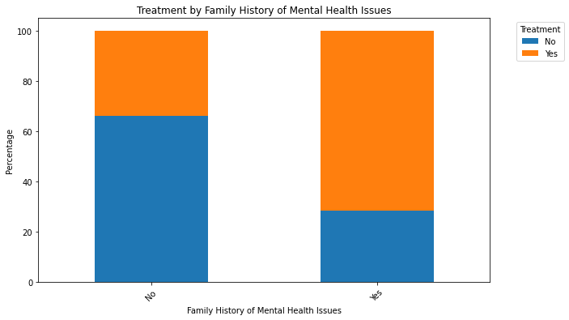
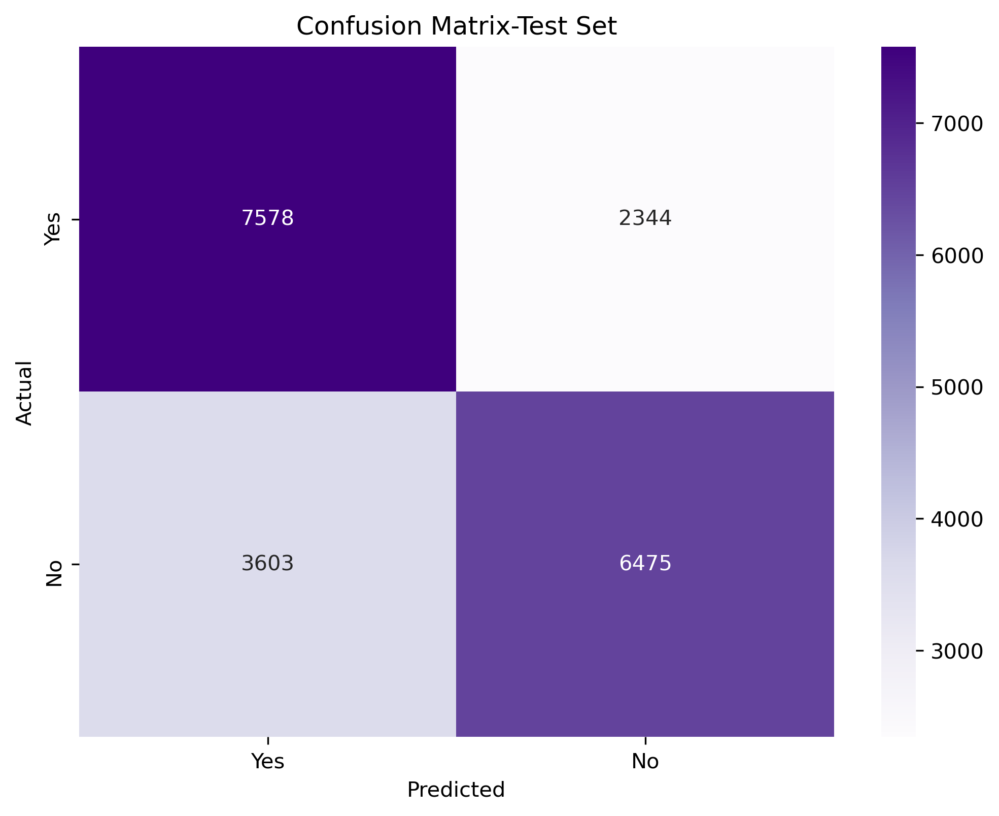
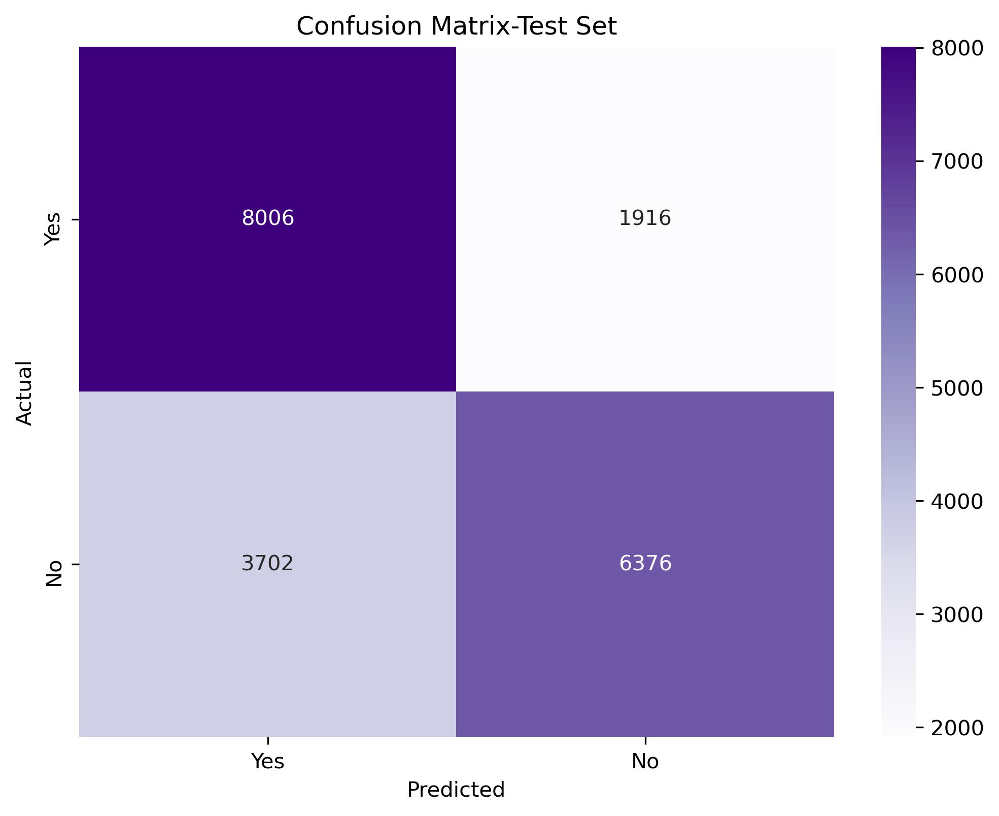
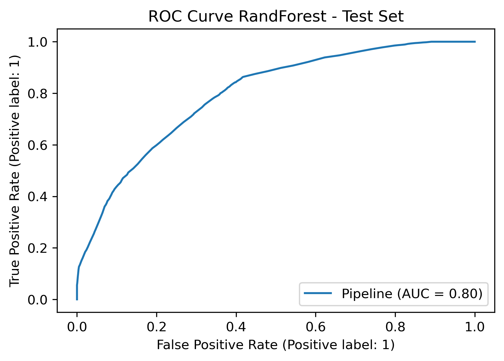
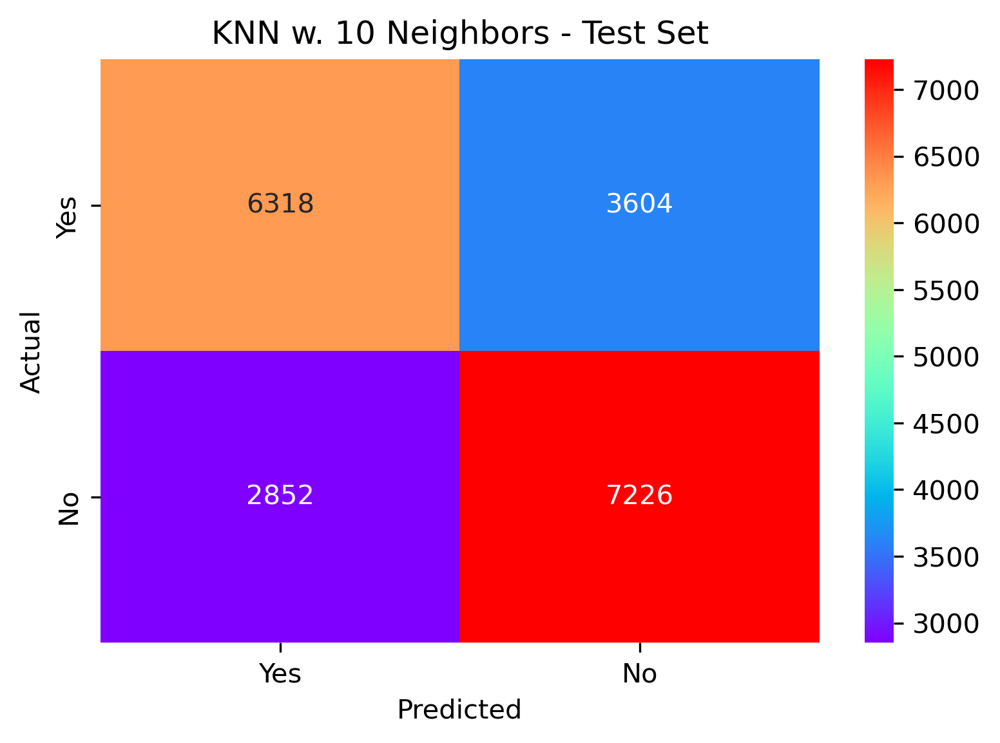

# Will-They-Seek-Treatment
   A model that can predict whether someone would seek treatment for a mental illness on their own.

## Business Understanding:
   Mental Illness is a real issue in the United States but too many people do not want to talk about it or admit it. Sometimes they feel it is a weakness or that nobody would understand. Sometimes they just do not know where to start. Some even feel like it is so over dramatized now a days, they do not want to be just part of the hype.
   
   My goal is to build a predictive model to determine if someone would seek treatment for a mental illness or not. This project means a lot to me because I have close friends and family members who deal with mental illness. Some did seek treatment did seek treatment on their own, while others needed a little encouragement and to know they were not alone.
   
   So, I geared this project towards everyday friends and family members who feel someone close to them may be struggling with a mental illness. My motivation for this project is to hopefully deploy a model to help people recognize those who need treatment but will not seek it for themselves. 
   
   
## Dataset:
   I decided to work with the Mental Health Dataset from Kaggle. 

   https://www.kaggle.com/datasets/bhavikjikadara/mental-health-dataset

   The features are all clear and defined and the overall data looks clean. The data is in a CSV format. It consists of just under 300,000 rows and 17 columns. The data types are all objects and are mostly strings or booleans.
   
   #### Column Explanations:
1. __Timestamp__ - Time survey was submitted.
2. __Gender__ - Respondent's Gender.
3. __Country__ - Respondent's Country.
4. __Occupation__ - Respondent's Occupation.
5. __Self Employed__ - Whether the Respondent is self-employed.
6. __Family History__ - Whether there is a family history of mental health issues.
7. __Treatment__ - Whether the Respondent sought treatment for mental health issues.
8. __Days Indoors__ - Number of days Respondent spends inside.
9. __Growing Stress__ - Whether the Respondent is experiencing growing stress.
10. __Changes Habits__ - Whether the Respondent has changed their eating or sleeping habits.
11. __Mental Health History__ - Whether the Respondent has a history of mental health issues.
12. __Mood Swings__ - The frequency of mood swings experienced by the Respondent.
13. __Coping Struggles__ - Whether the Respondent struggles to cope with daily problems/stress.
14. __Work Interest__ - Whether the Respondent has lost interest in work.
15. __Social Interest__ - Whether the Respondent feels socially weak.
16. __Mental Health Interview__ - Willingness to discuss mental health in an interview.
17. __Care Options__ - Respondent's awareness of mental health care options available?

## EDAs, Down Sampling and Feature Selection:
   I dropped the Timestamps column, kept only the United States cases, and I simply dropped the nulls from Self Employed. This left me roughly 168,000 rows across 16 columns.  
   
   From there I decided to downsize the dataset by down sampling the target variable Treatment to include 50,000 Yes's and 50,000 No's.
    
   
    
   I compared a few other columns to Treatment using bar charts such as Family History of Mental Health and Awareness of Care Options. 
   

  
  

   
   Since my Data Frame is entirely categorical values, I decided to create a for loop to preform a __Chi-Squared test__ on each column versus Treatment to determine which features correlate the most with my target variable.

I Formulated a single Hypotheses for each pair of variables.

__H0 (Null Hypothesis):__ There is no association between the two categorical variables (example: between treatment and Occupation).

__H1 (Alternative Hypothesis):__ There is an association between the two categorical variables.

   Here are a few of the results. The full results can be seen in the EDAs-Feature Selection Notebook.
   
   __Variable:__ Gender  
   __Chi-Squared Statistic:__ 2399.6832634032644  
   __P-value:__ 0.00000  
   __Degrees of Freedom:__ 1  
   __Decision:__ Reject the null hypothesis - There is a significant association between the variables.  
    
   __Variable:__ Growing_Stress  
   __Chi-Squared Statistic:__ 10.151899207838625  
   __P-value:__ 0.00625  
   __Degrees of Freedom:__ 2  
   __Decision:__ Reject the null hypothesis - There is a significant association between the variables.  
   
   __Variable:__ Social_Weakness  
   __Chi-Squared Statistic:__ 0.6468916752472398  
   __P-value:__ 0.72365  
   __Degrees of Freedom:__ 2  
   __Decision:__ Fail to reject the null hypothesis - There is no significant association between the variables.  
   
   The Chi-Squared tests show a significant association between __Treatment__ and the __Gender__, __Family History__, __Mental Health Interview__, __Care Options__, __Self Employed__, __Coping Struggles__, and the __Growing Stress__ columns. This is because their P-value is less than the 0.05 significance level. So, I will be using these columns for my model.

   The Chi-Squared tests show no significant association between __Treatment__ and the __Mood Swings__, __Work Interest__, __Days Indoors__, __Social Weakness__, __Changes Habits__ , __Occupation__, and the __Mental Health History__ columns.

## Train-Test Split & Basic Pipeline Set-up:
   Since all my columns are categorical and not ordered, I'll be using __One Hot Encoder__ to convert my data into numerical format. 

   I used __Train-Test Split__ with an 80/20 split and __Cross-Validation__. I also mapped my target variable (y) to be __Yes = 1__ and __No = 0.__  

__I labeled my TP, TN, FP, and FN as follows:__

•	__True Positives (TP):__ The number of individuals who were correctly predicted to seek treatment for a mental illness (i.e., the model predicted "Yes" for treatment, and the actual value was also "Yes").

•	__True Negatives (TN):__ The number of individuals who were correctly predicted not to seek treatment for a mental illness (i.e., the model predicted "No" for treatment, and the actual value was also "No").

•	__False Positives (FP):__ The number of individuals who were incorrectly predicted to seek treatment for a mental illness (i.e., the model predicted "Yes" for treatment, but the actual value was "No").

•	__False Negatives (FN):__ The number of individuals who were incorrectly predicted not to seek treatment for a mental illness (i.e., the model predicted "No" for treatment, but the actual value was "Yes").

Since my dataset is balanced 50/50 now, I will be focusing on __Accuracy__ as my metric.

At this time before preprocessing, I have 100,000 rows and 8 columns including my Target Column.

I set up a basic pipeline with ColumnTransformer and One Hot Encoder as my preprocessor.

After OneHotEncoder, my dataset contains 18 columns, including the Treatment Column (Which did not get encoded).

## Models and Findings:
   ### BASELINE MODEL: LOGISTIC REGRESSION
   I chose Logistic Regression as my Baseline model because it's simple and quick to use and easy to read. It's a great starting point to understand how the data might be read by the model.
   
   I got an __Accuracy score__ of __70.26%__  on the Test Set. And a score of __70.84%__ with cross-validation scores ranging from 70.3% to 71.6% on the Training Set. This means the model is generalizing very well to unseen data.  
   
The __TP__, __TN__, __FP__, __FN__ and ROC Curve can be seen below.

  
  

__AUC-ROC:__ 0.7690249774796298  

__TP:__ __7,578__ -------- __FP:__ __3,603__

__TN:__ __6,475__ -------- __FN:__ __2,344__

   ### SECOND MODEL: RANDOM FOREST
   I chose Random Forest as my second model because it reduces the risk of overfitting and tends to have low bias because it builds many decision trees and makes predictions based on the majority vote from all the trees.
   
   I got an increased __Accuracy score__ of __71.91%__ on the Test Set. And an increased score of 72.76% with cross-validation ranging from 71.8% to 73.5% on the Training Set.  The __ROC Curve__ shows an __79.53%__ prediction rate for the model's ability to rank predictions correctly.  

  
  

 

   After __Hyperparameter Tuning__, I was able to see a VERY small increase in the __Accuracy Score__ on the Training and Test Set. 
   

__Original Training Set:__ 72.75875% ------ __HyperTuned Training Set:__ 72.76%  
__Original Testing Set:__  71.91%    ------ __HyperTuned Testing Set:__  71.915%  

The TP, TN, FP, FN show some variation between the Original Testing set and the HyperTuned Testing set.

__TP:__ Original Test Set: __8,006__ ------ HyperTuned Test Set: __8,046__  

__TN:__ Original Test Set: __6,376__ ------ HyperTuned Test Set: __6,337__  

__FP:__ Original Test Set: __3,702__ ------ HyperTuned Test Set: __3,741__  

__FN:__ Original Test Set: __1,916__ ------ HyperTuned Test Set: __1,876__  

   ### THIRD MODEL: XGB CLASSIFIER
   I chose Extreme Gradient Boosting (XGB) classifier as my third model because although it is also an ensemble method based on decision trees, it has advanced features that Random Forest does not. Such as Gradient Boosting, Regularization, and built in Cross-Validation.
   
   The XGB Classifier __Accuracy score__ (__71.92%__) is identical to the HyperTuned Random Forest Model (also 71.92%) in the sense of overall accuracy. And the __ROC Curve__ shows an __79.53%__ prediction rate for the model's ability to rank predictions correctly. 
   

  
  

 
   
   After __Hyperparameter Tuning__, the model this time showed a slight decrease in the __Accuracy score__ going from 71.92% to __71.89%__.  So far, this does seem to be my best model. It has the least amount of False Positives out of all the models(HyperTuned and Originals) except my baseline model which only had 3,603 False Positives.  
   
   

__TP:__ Original Test Set: __8,046__ ------ HyperTuned Test Set: __7,997__  

__TN:__ Original Test Set: __6,337__ ------ HyperTuned Test Set: __6,380__  

__FP:__ Original Test Set: __3,741__ ------ HyperTuned Test Set: __3,698__  

__FN:__ Original Test Set: __1,876__ ------ HyperTuned Test Set: __1,925__  

## MODEL STACKING:
   I decided to try to stack my models together to try to acheive better results.

I started by defining the "Base Models" as the Logistic Regression model and the HyperTuned models for Random Forest and XGBoost.  I could not get Best_Model to work properly within the Meta Model, which is why I listed the Best Model's parameters out. Plus, I personally perfer to see the full list of parameters being used in each model. 

__BLOCK 1:__ consists of:
* Creating a Meta-Model as my final estimator,
* Stacking the base models and final estimator using Stacking Classifier,
* Establishing and Fitting the final pipeline AND
* Calculating the Accuracy and Classification Report.
                     
__BLOCK 2:__ is the Visualization of the Confusion Matrix

__BLOCK 3:__ is the Visualization of the ROC Curve

I used these three blocks to plug and play with several different models and parameters to try to find the best one to use for my final model.

I plugged and played with several different models and parameters as my Meta-Model.  The results for several of the models can be found inside the Models-Conclusions Notebook.  After running about 15 different models, my final decision was between K-Nearest Neighbor (KNN) and Support Vector Classifier (SVC) which are listed below.

__Support Vector Classifier:__ --- __Accuracy:__ = 72.21%  

* __K-Nearest Neighbor:__ --- __Accuracy:__ = 67.72%

I decided to use the K-Nearest Neighbors for my Meta-Model instead of the others because out of all my models (including my original and Hypertuned models), it had the lowest number of False Positives and the highest number of True Negatives.  The Accuracy Score is lower than my other models but the ROC Curve has a 76% prediction rate for the model's ability to rank predictions correctly.  

I used the True Negatives and False Positives as my deciding factor because they are what my model needs to focus on the most.  I want my model to predict those individuals unlikely to seek treatment for themselves, more so than those who are willing to seek treatment on their own.

From here I wanted to see if there was a better Number of Neighbors parameter I could use for it, since my current setting was n_neighbors=10.

I created a new KNN model and plugged it into my original Preprocessing Pipeline.  I then ran GridSearchCV to find the best Number of Neighbors between 1 and 31 for my model.  

It gave n_neighbors=25 as the best parameter.

I plugged this back into Blocks 1-3 and determined the results weren't what I was looking for. It dropped my True Negatives and raised my False Positives.

__KNN-Neighbors=25:__ --- __Accuracy:__ = 70.265%

  
  

 
I decided to use Blocks 1-3 to test the other Number of Neighbors manually. I listed several of the results inside the Models-Conclusions Notebook. Overall, I found that 10 Neighbors seemed to produce the most wanted results. And decided to use it as my final model for my Meta-Model.

## 6. Conclusion and Next Steps:

In __conclusion__, although I was able to raise my overall accuracy scores by manipulated the models both inside and out of the Stacking Ensemble, I decided focusing on the model that produced the most True Negative and the least False Positives was my best choice.

My __Next Steps__ include:
* Rerunning my models and focusing on Feature Importance to try to improve my overall scores,
* Adding in an interactive Visualization that shows feature correlation,
* Deploying the model with appropriate warnings and resources available
 
 
 ## Repository Structure

├── Data  
├── Images  
├── .gitignore  
├── EDAs-Feature Selection.ipynb   
├── Models-Conclusions.ipynb    
└── README.md  

